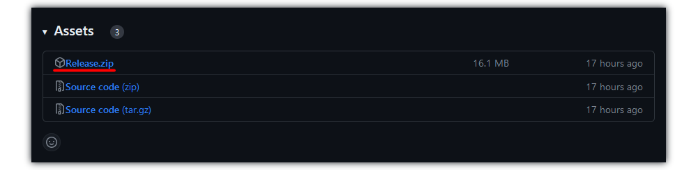
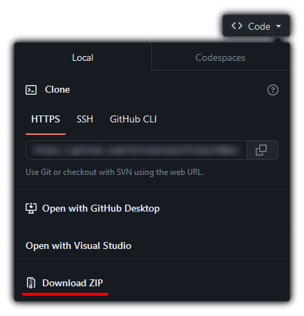
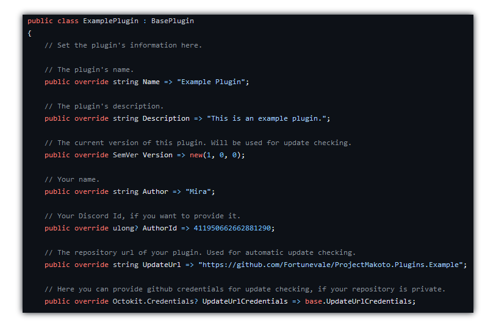

<h1 align="center">Makoto</h1>

A feature packed discord bot!

<a href="#getting-makoto" >

</a>

 

 

## Developing Plugins

1. Download the latest version of Makoto [here](https://github.com/Fortunevale/ProjectMakoto/releases).

2. Download the example plugin's source code [here](https://github.com/Fortunevale/ProjectMakoto.Plugins.Example).

3. Create a folder called `deps` in the root directory of the example plugin.

4. Drop all files of release zip archive into the `deps` folder.

5. Open the project.

6. Specify your Plugin's Name, Author and other details in `ExamplePlugin.cs`.
    - The comments should help you get started.
    - You can rename this file, project and everything else, inheriting the `BasePlugin` is what matters for Makoto to find and load your plugin.

## Testing your plugin

You need to set up Makoto ([Guide](CONTRIBUTING.md#running-makoto-with-all-necessary-dependencies)). Running/Debugging Makoto with all necessary dependencies.

To run Makoto, you can instead use `dotnet run ProjectMakoto.dll` in the folder you saved Makoto to in Step 1 of Developing.