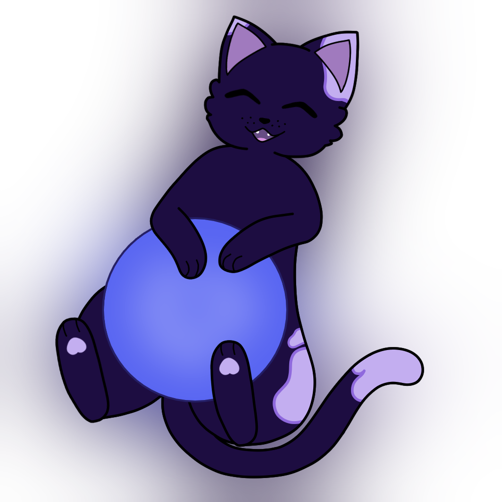

<h1 align="center">Makoto</h1>

A feature packed discord bot!

<a href="#getting-makoto" >

</a>

 

 

## What is Makoto?

**Makoto is a multi-purpose Discord Bot written in C# using .NET 8.**
  
Makoto has a lot of features, current notable features are:
- **No premium features**. (This may change in the future, it'll depend on how viable a hosting this bot is without them. The source code itself will always stay available and you could simply host your own Makoto instance.)
  
- **Music Playback**
- Customizable **protection against phishing** and other malicious websites, with little to no false positives.
- Easy to set up **Reaction Roles**.
- An easy to use **emoji and sticker stealer**.
- A **Bump Reminder** with a subscriber role to never miss bumping your server.
  
- Important **Moderation Features** such as a **detailed Actionlog**, commands to quickly clean up the chat(s) like `purge` or `guild-purge` and more.
- Quick and Easy **Message Translation** through the `Apps` Context Menu.
- **[ScoreSaber API](https://scoresaber.com)** Integration.
- An **experience** system with **role rewards**.
- **Social Commands** like `hug`, `pat` and a few more.
- **Automatic Nickname Normalization**, allowing quickly mentioning people with non-standard characters in their usernames.
- **Invite Tracking** so you can track a Raid's origin with just a few commands***.
  
- A system to **backup** user's **roles** and **nickname** when they leave*.
- **Custom Embed Creator** within Discord.
- **Embeds** for **message links** and **github code**.
- **Automatic Thread Unarchiving**, allowing threads to stay open for as long as you want them to.
- **Automatic Crossposting** so you can have automatic feeds in announcement channels.
- Additional Privacy and Security Features such as the **In-Voice Chat Privacy** or the **automatic bot/user token invalidation**.
  
##### \* Roles with any significant Permissions like Administrator won't be re-applied. In addition, if the user hasn't been on the server for more than 60 days, neither the roles nor the nickname will be reapplied. Also the `clearbackup` command gives moderators ability to remove stored roles.

##### \** A guild-purge is similar to a purge command. However, instead of scanning just one channel for messages by the specified user, it scans all channels.

##### \*** This depends on how users can join your server. If they join through invites by, for example, Disboard or through the Vanity Invite, it won't be as easy to track them down.
  
## Getting Makoto

## [Click here to invite the bot](https://discord.com/api/oauth2/authorize?client_id=947716263394824213&permissions=8&scope=bot%20applications.commands)

- Phishing Protection is enabled by default, people will be banned if they send a link known to be malicious. To change this, run `/config phishing`.
- Automatic User/Bot Token invalidation is turned on by default. If you don't know what this means, just leave it on. If you know what this means and you don't want this happen, run `/config tokendetection` to disable it.
- Every new server is automatically opted into a global ban system. When someone is known to break Discord's TOS or Community Guidelines, they'll be banned on join or when the ban happens. They will not be banned when the bot is freshly added to your server. To change this behaviour you can use `/config join`.
- You can join a support server [here](https://s.aitsys.dev/makotoguild).
  
## Building, Debugging and Deployment

We have a step by step guide you can follow to start contributing to or running Makoto [here](./CONTRIBUTING.md).
## Credits

- [DisCatSharp](https://github.com/Aiko-IT-Systems/DisCatSharp) by Aiko-IT-Systems
- [Lavalink](https://github.com/freyacodes/Lavalink) by freyacodes
- [LibreTranslate](https://github.com/LibreTranslate/LibreTranslate) by LibreTranslate
#### Phishing Link Repositories
- [discord-tokenlogger-link-list](https://github.com/nikolaischunk/discord-tokenlogger-link-list/) by nikolaischunk
- [links](https://github.com/DevSpen/links/) by DevSpen
- [SteamScamSites](https://github.com/PoorPocketsMcNewHold/SteamScamSites/) by PoorPocketsMcNewHold
- [fluffy-blocklist](https://github.com/sk-cat/fluffy-blocklist/) by sk-cat
- [videogame-scam-blocklist](https://github.com/Vytrah/videogame-scam-blocklist/) by Vytrah
